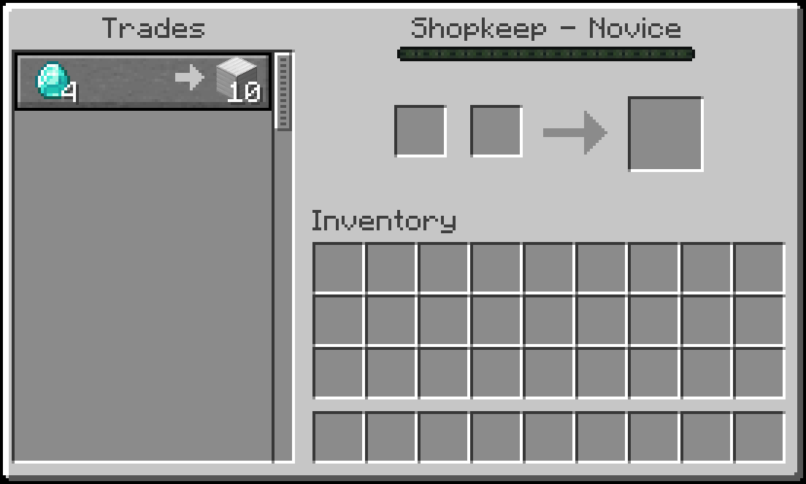

# Villager Shopkeeps Datapack
<em>By FancyPotatOS</em>

This datapack repurposes Nitwits to maintain a shop for you.

### About This Datapack

_Instructions always come 'pre-installed' on every Nitwit._

By throwing specifically-named bundles at nitwits, you are able to change its trade.

Stock up the Shopkeep with the item it sells and all players will be able to trade with it:

Later on, the owner can retrieve the traded items!

**_No items are created or destroyed in the process of interacting with a Shopkeep (either as a owner or consumer), making this datapack Vanilla-friendly!_**

